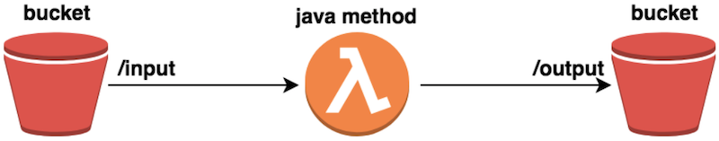

# Different methods to provision AWS Lambdas

This project contains examples of different AWS Lambda provisioning tools.

The examples of usage are in corresponding README.md files.

Follows the file layout of the repository:

    aws-lambda-provisioning-methods/
        +--app
        +--development
        |   +--cloudformation
        |   |   --lambda_cfn.yaml
        |   |   --lambda_params.json
        |   |   --README.md
        |   +--sam
        |   |   --README.md
        |   |   --template.yaml
        |   +--serverless
        |   |   +--dev
        |   |   |   --var.yml
        |   |   --README.md
        |   |   --serverless.yml
        |   +--terraform
        |   |   --main.tf
        |   |   --README.md
        +--doc
        --pom.xml
        --README.md